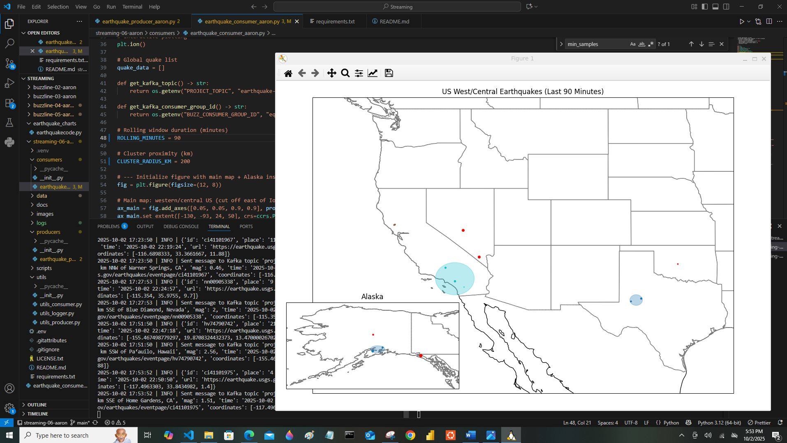
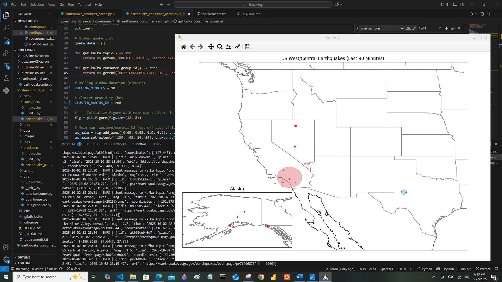
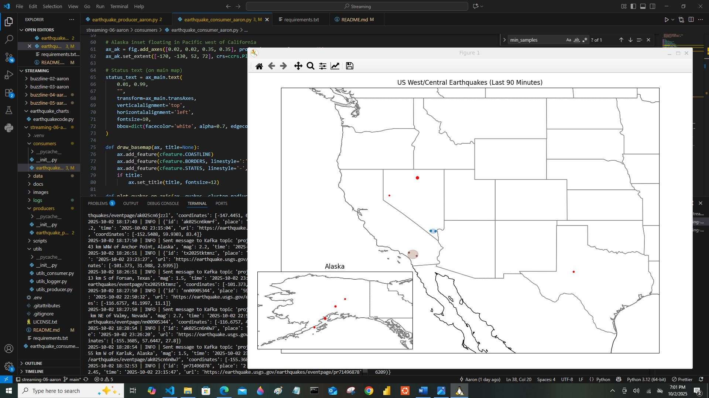

# streaming-06-aaron

# Earthquake Streaming Visualization

## Overview

The big idea is to have a visualization of when earthquakes occur in real time, close together, and within a specified distance and time window.

This class project takes live data from the USGS feed via an API call in a Kafka producer. That producer updates a topic, which is then read by the consumer. The consumer takes the data and posts it to a live map. A key feature of the map is placing a semi-transparent circle around earthquakes that occur within a given distance of each other.

## Considerations:

Live USGS data mostly comes from the western United States and Alaska. Other countries do report, but generally only higher-magnitude quakes. Since the focus of this class is streaming live data, I used this geographic region to increase the number of data points in a given timeframe.

I set the circle feature to trigger for just two or more quakes near each other. I originally wanted three or more, but adjusted it to ensure the code executed correctly. This demonstrates the ability to group and the potential to notify. I did not set up notifications for these rules, but that could be done.

The map removes data points after a specified time period. This, along with the distance between earthquakes, is configurable. For example, you could set it to 20 minutes and 100 miles apart, and have that shown on the map as well as trigger a notification. This would be quite rare, however. I opened up the time and distance thresholds to both achieve a live data stream and exercise the clustering feature.

## Key Features

Live Data Stream from USGS in real time

Kafka Integration (producer + consumer)

Cluster Detection with DBSCAN & geodesic distance

Configurable Parameters (distance, time window, clustering threshold)

Rolling Window to automatically drop older quakes

Inset Alaska Map plotted alongside the western U.S.

## Technologies Used

Python

Kafka (producer/consumer)

Matplotlib – visualization

Cartopy – mapping & geospatial rendering

Scikit-learn – clustering (DBSCAN)

Shapely & Haversine – geometry & distance calculations

dotenv – environment variable management 

## The Visualization in Action.







## Steps to recrated this projec

## 1. Copy This Project

1. Copy/fork this project into your GitHub account
2. Name it whatever you want.


---

## 2. If Windows, Start WSL, Install components for GEOSPATIAL / MAPPING

Launch WSL. Open a PowerShell terminal in VS Code. Run the following command:

```powershell
wsl
```

You should now be in a Linux shell (prompt shows something like `username@DESKTOP:.../repo-name$`).

Installing the following items to support the maps portion of this project inside of wsl Can be installed at system level. Do not need to be in .venv.

```wsl
sudo apt-get update
sudo apt-get install -y libproj-dev proj-data proj-bin libgeos-dev libgdal-dev gdal-bin
```


Do **all** steps related to starting Kafka in this WSL window.

---

## 3. Start Kafka (using WSL if Windows)

In P2, you downloaded, installed, configured a local Kafka service.
Before starting, run a short prep script to ensure Kafka has a persistent data directory and meta.properties set up. This step works on WSL, macOS, and Linux - be sure you have the $ prompt and you are in the root project folder.

1. Make sure the script is executable.
2. Run the shell script to set up Kafka.
3. Cd (change directory) to the kafka directory.
4. Start the Kafka server in the foreground.
5. Keep this terminal open - Kafka will run here
6. Watch for "started (kafka.server.KafkaServer)" message

```bash
chmod +x scripts/prepare_kafka.sh
scripts/prepare_kafka.sh
cd ~/kafka
bin/kafka-server-start.sh config/kraft/server.properties
```

**Keep this terminal open!** Kafka is running and needs to stay active.

For detailed instructions, see [SETUP_KAFKA](https://github.com/denisecase/buzzline-02-case/blob/main/SETUP_KAFKA.md) from Project 2. 

---

## 4. Manage Local Project Virtual Environment

Open your project in VS Code and use the commands for your operating system to:

1. Create a Python virtual environment
2. Activate the virtual environment
3. Upgrade pip
4. Install from requirements.txt

### Windows

Open a new PowerShell terminal in VS Code (Terminal / New Terminal / PowerShell).

```powershell
py -3.11 -m venv .venv
.venv\Scripts\Activate.ps1
py -m pip install --upgrade pip wheel setuptools
py -m pip install --upgrade -r requirements.txt
```

If you get execution policy error, run this first:
`Set-ExecutionPolicy -ExecutionPolicy RemoteSigned -Scope CurrentUser`

### Mac / Linux

Open a new terminal in VS Code (Terminal / New Terminal)

```bash
python3 -m venv .venv
source .venv/bin/activate
python3 -m pip install --upgrade pip
python3 -m pip install --upgrade -r requirements.txt
```

---

## 5. Run Streaming Application

This will take two terminals:

1. One to run the producer which writes to a Kafka Topic.
2. Another to run the consumer which reads from the dynamically updated Kafka Topic.

### Producer Terminal

Start the producer to get the earthquate data from the api and post to a topic.

In VS Code, open a NEW terminal.
Use the commands below to activate .venv, and start the producer.

Windows:

```shell
.venv\Scripts\activate
py -m producers.earthquake_producer_aaron
```

Mac/Linux:

```zsh
source .venv/bin/activate
python3 -m producers.earthquake_producer_aaron
```

### Consumer Terminal

Start the associated consumer that will process and visualize the messages.

In VS Code, open a NEW terminal in your root project folder.
Use the commands below to activate .venv, and start the consumer.

Windows:

```shell
.venv\Scripts\activate
py -m consumers.earthquake_consumer_aaron.py
```

Mac/Linux:

```zsh
source .venv/bin/activate
python3 -m consumers.earthquake_consumer_aaron.py
```


## Optional: Save Space

To save disk space, you can delete the .venv folder when not actively working on this project.
You can always recreate it, activate it, and reinstall the necessary packages later.
Managing Python virtual environments is a valuable skill.

## License

This project is licensed under the MIT License as an example project.
You are encouraged to fork, copy, explore, and modify the code as you like.
See the [LICENSE](LICENSE.txt) file for more.

